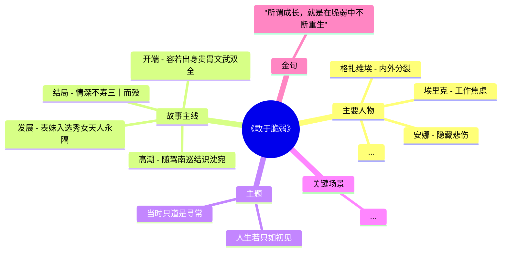

# 架构设计 · 三层数据流闭环

> 本文档深入讲解 jiujiu-bookstack 的核心设计哲学。

## 🎯 设计哲学

**LLM 写应用层内容时，不应该从原文 chunks 蒙眼开始。**

写一个游戏化剧本应该看到：
- ✅ 提炼好的角色列表（避免 LLM 自己编造）
- ✅ 情节弧脉络（避免平铺直叙）
- ✅ 叙事框架（如"起承转合"模板）
- ✅ 关键金句（直接引用，不必 LLM 复述）

**这就是"三层数据流闭环"的核心**：让上游的产出作为下游的输入，每层都精炼上一层。

---

## 🌊 完整数据流向

```
[原始 epub 文件]
      ↓
[步骤1: import] ← 文本提取 + 章节切分
      ↓
chunks (数据库 chunks 表)
      ↓
[步骤2: embed] ← bge-m3 1024维向量
      ↓
chunk_vectors
      ↓
[步骤3.5: mindmap] ← LLM 提炼结构骨架
   ├── 主要人物（24个）
   ├── 故事主线（开端/发展/高潮/结局）
   ├── 主题（4-8个）
   ├── 关键场景（3-5个）
   └── 金句（1-3句原文）
      ↓
[mindmaps/{id}.mmd + book_mindmaps 表]
      ↓
[步骤4: skill] ← LLM 引用 mindmap 写叙事框架
   ├── 7+ 核心框架（如"脆弱二元对立""橡树与芦苇寓言"）
   ├── 完整角色面具光谱（24 个角色名全列出）
   ├── 章节索引表（41 章节）
   ├── 关键术语表（cheatsheet.md）
   └── 反模式识别（patterns.md）
      ↓
[skill-archive/books/{name}/SKILL.md + cheatsheet/glossary/patterns/chapters/]
      ↓
[步骤5-6: script + tts] ← LLM 引用 skill + mindmap 写游戏化剧本
   ├── 10-15 个场景（含起承转合 + 1-2 个分支点）
   ├── 24-35 个问题（MC + OE + 角色扮演）
   ├── 3 个 NPC 角色（性格/语气/职能）
   ├── 每个场景 TTS 音频（zhCNYunxi 音色）
   └── worldview_theme 标签
      ↓
[game_scripts 表 + tts/ 目录]
      ↓
[步骤7: summary] ← LLM 引用 skill + mindmap 写叙事化摘要
   ├── 500-1000 字
   ├── 完整角色名（24 个全引用）
   ├── 主题提炼（mindmap 主题词）
   └── 引用 SKILL.md 框架
      ↓
[books.summary]
      ↓
[步骤8: dedup] ← 同名变体查重 + 合并建议
```

---

## 📦 每层产物的形态

### Layer 1: chunks（数据层）

```sql
CREATE TABLE chunks (
    id SERIAL PRIMARY KEY,
    book_id INTEGER REFERENCES books(id),
    chunk_text TEXT NOT NULL,
    char_count INTEGER,
    -- ... 索引
);
CREATE TABLE chunk_vectors (
    chunk_id INTEGER PRIMARY KEY REFERENCES chunks(id),
    embedding vector(1024)  -- pgvector
);
```

存储形态：**纯文本 + 向量**，可被 `semantic_search` 直接检索。

---

### Layer 2: mindmap（结构骨架）



**特点**：
- 通用性强（任何 LLM 都能读懂 mermaid）
- 节点数 20-50（避免信息过载）
- **直接作为下游 prompt 的参考文本**（截断 2000 字符）

---

### Layer 3: SKILL.md（叙事地图）

```markdown
---
name: 敢于脆弱
author: 吉娜维芙·阿弗里伊尔
category: 成长心理
description: 从24个临床案例中提炼脆弱心理学...
---

# 敢于脆弱

## Core Frameworks
### 1. 脆弱二元对立框架
- **封闭姿态**（否认型）
- **沉溺姿态**（放任型）
- **第三条路**（本书主张）

### 2. 面具人格光谱
24个案例呈现"戴什么面具"的连续光谱：
安娜 → 埃里克 → 格扎维埃 → ...

### 3. 橡树与芦苇寓言（核心隐喻）
- **橡树型人格**：强硬、拒绝示弱
- **芦苇型人格**：柔软、随风弯腰
```

**特点**：
- 人类可读（agent 当 wiki 查）
- 结构化（frontmatter + 标题层级）
- **作为下游 script 和 summary 的 prompt 上下文**

---

### Layer 4: game_scripts（应用层）

```json
{
  "version": "2.1",
  "book_id": 384,
  "narrative_arc": {
    "起": "s1-s3 场景范围（铺垫：身份/世界/初遇）",
    "承": "s4-s6 场景范围（深入：细节/情感/连接）",
    "转": "s7-s10 场景范围（含 1-2 个分支点）",
    "合": "s11-s13 场景范围（升华 + 行动指引）"
  },
  "scenes": [
    {
      "id": "s1",
      "title": "芦苇的呼吸",
      "act": "起",
      "description": "深秋的北京，你——笑笑，一个十三岁的初一女生...",
      "questions": [
        {
          "type": "comprehension_mc",
          "question": "...",
          "options": ["A", "B", "C", "D"],
          "correct": "A",
          "explanation": "...",
          "role_perspective": "主角"
        }
      ]
    }
  ]
}
```

**特点**：
- 多题型（MC + OE + 角色扮演 + 排序）
- 起承转合完整
- 每个 question 引用 `source_chunk_id`（保证答案有原文支撑）
- 每个 OE 挂 `worldview_theme` 标签（用于世界观对齐）

---

## 🛡️ 三层防护

### 防护 1：向量优先断言（vectorize-first）

**原则**：embedding 必须 100% 完成才能进 step 3。

**为什么**：避免 embedding debt 越积越多（2026-07-31 教训：重跑时没断言，向量化漏了一批书）。

**实现**：
```python
def _assert_embedding_ready(book_id):
    pending = get_conn().execute(
        "SELECT COUNT(*) FROM chunks WHERE book_id=%s AND embedding IS NULL", (book_id,)
    ).fetchone()[0]
    if pending > 0:
        raise RuntimeError(f"❌ book {book_id} 有 {pending} chunks 未嵌入，先跑 embed 步骤")
```

### 防护 2：LLM fallback 链

**主用** → **备用1** → **备用2** → **本地兜底**

```python
configs = [
    ("https://api.anthropic.com/v1/messages", key, "claude-sonnet-4-5"),
    ("https://api.openai.com/v1/chat/completions", key, "gpt-4o-mini"),
    ("http://localhost:11434/v1/chat/completions", "", "llama3"),  # 本地
]
```

**为什么**：单 provider 配额耗尽 / 限流 时不中断全流程。

### 防护 3：敏感词自动脱敏

**问题**：minimax API 触发 `input new_sensitive (1026)` = 内容审核拦截。

**实现**：
```python
from text_sanitize import sanitize

def call_llm(prompt):
    prompt = sanitize(prompt)  # 用词库替换已知触发词
    response = requests.post(url, json={"prompt": prompt})
    if response.status_code == 500 and 'new_sensitive' in response.text:
        # 二分定位未知触发词
        bad_segment = bisect(prompt, llm_caller)
        add_to_word_library(bad_segment)  # 自动入库
    return response
```

---

## 🔄 幂等设计

**原则**：重跑同一本书，**所有产物保持不变**（除非显式 `--force`）。

**实现**：
- import: `UNIQUE (book_id, MD5(chunk_text))` 防重复
- embed: `ON CONFLICT (chunk_id) DO UPDATE`
- script: `UNIQUE (book_id, chapter_index, game_type)` + `ON CONFLICT DO UPDATE`
- summary: 已有则返回（除非 `--force` 清空）
- mindmap: 文件覆盖（带时间戳），PG 表 UPSERT

**验证**：book 384 三次跑 force（18:01 / 18:08 / 21:22），最终 PG 数据一致。

---

## 📈 扩展性

### 替换 LLM

修改 `config/config.yaml` 即可，所有 LLM 调用走抽象层。

### 新增分类

编辑 `config/category_rules.yaml`：
```yaml
文学:
  pattern: "^初[一二三]第[0-9]辑|古典文学|诗词"
```

### 自定义模板

修改 `scripts/llm_client.py` 里的 prompt template。

### 添加新产物

只要新产物能引用上游（chunks/mindmap/skill），就符合闭环设计哲学。

---

## 🆚 和同类项目的区别

| 项目 | 关注点 | jiujiu-bookstack |
|------|--------|-----------------|
| **LangChain** | LLM 编排框架 | 我们是**垂直应用**，不造轮子 |
| **私人 RAG** | 单文档问答 | 我们是**书库全量** + 多产物 |
| **剧本质生成器** | 单次生成 | 我们是**批量 + 幂等 + 重跑** |
| **向量数据库** | 检索 | 我们是**检索 + 结构化提取 + 应用层** |

**一句话**：jiujiu-bookstack = RAG + 剧本生成 + 知识图谱，但以"三层数据流闭环"为核心设计哲学。
