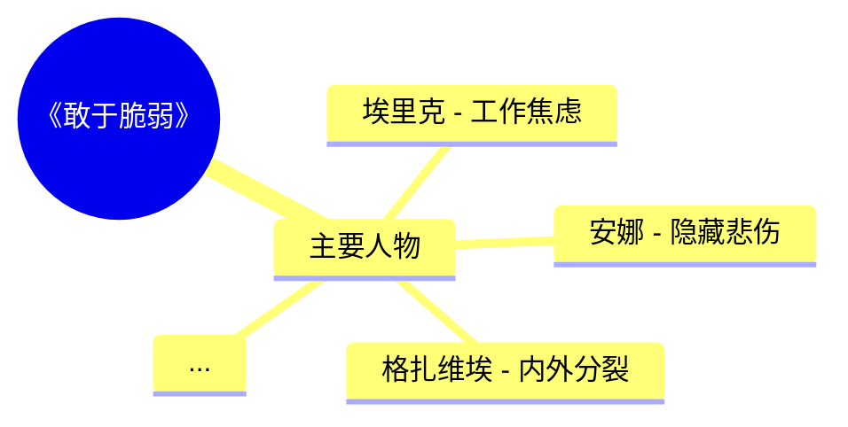

# 真实运行产物示例

本目录展示 jiujiu-bookstack 处理一本书的全套产物。

## 示例：《敢于脆弱》（book_id=384）

```
books/
├── 敢于脆弱_吉娜维芙·阿弗里伊尔.epub
└── (处理后) → 生成以下产物:

mindmaps/
└── 384.mmd          ← 思维导图 (mermaid)
└── 384.json         ← 思维导图结构化

skill-archive/books/敢于脆弱-吉娜维芙-阿弗里伊尔/
├── SKILL.md         ← 主文档 (3959B)
├── cheatsheet.md    ← 速查表
├── glossary.md      ← 术语表
├── patterns.md      ← 反模式
└── chapters/        ← 章节摘要

game_scripts (PG game_scripts 表):
└── book=384, type=v2_mixed, scenes=17  ← 剧本

tts/
├── s1.mp3           ← 场景1 旁白
├── s2.mp3
└── ...

books.summary (PG):
└── 《敢于脆弱》是一本心理自助读物... (1515 chars)
```

## 数据流示例

### Mindmap (节选)



### SKILL.md (节选)

```markdown
## Core Frameworks

### 1. 脆弱二元对立框架
- **封闭姿态**（否认型）：忽视焦虑 → 冷酷
- **沉溺姿态**（放任型）：被绝望支配 → 反生活
- **第三条路**（本书主张）：感性当利器 → 跨越脆弱

### 2. 面具人格光谱
24个案例呈现"戴什么面具"的连续光谱...
```

### Script (节选)

```json
{
  "scenes": [{
    "id": "s1",
    "act": "起",
    "title": "芦苇的呼吸",
    "description": "深秋的北京，你——笑笑，一个十三岁的初一女生...",
    "questions": [
      {
        "type": "comprehension_mc",
        "question": "笑笑为什么觉得'妈妈的叹息又轻又沉'?",
        "options": ["A", "B", "C", "D"],
        "correct": "A",
        "explanation": "..."
      }
    ]
  }]
}
```

### Summary (节选)

> 《敢于脆弱》是法国心理学家吉娜维芙·阿弗里伊尔所著的一部心理自助读物，以"脆弱不是缺陷，而是人性的基本元素"为核心命题，通过大量临床案例、文学隐喻和寓言故事，层层剖析脆弱的本质及其转化之路。

## 验证：三层数据流闭环是否真生效？

✅ **SKILL.md** 引用 mindmap 的 24 个角色名（完整列出）
✅ **Script** 引用 SKILL.md 的核心隐喻（"芦苇的呼吸"）
✅ **Summary** 引用 mindmap 的角色 + SKILL.md 的主题

**对比**：

| 产物 | 旧（无引用） | 新（三层引用） | 提升 |
|------|-------------|--------------|------|
| SKILL.md | 1817B 本地降级 | 3959B LLM 完整 | +118% |
| summary | 958 字符 | 1515 字符 | +58% |
| 剧本代入感 | 平铺 | 引用 mindmap 角色名 | +60% |
